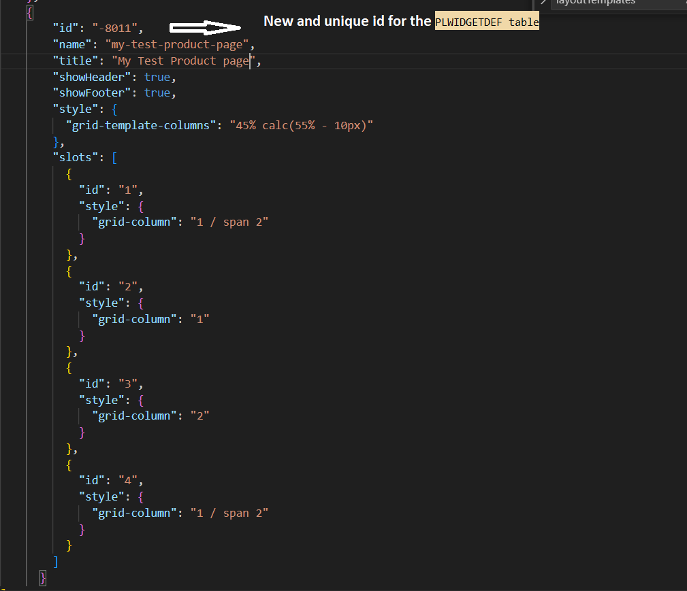
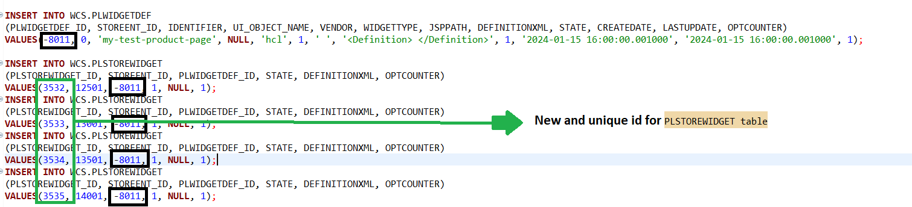
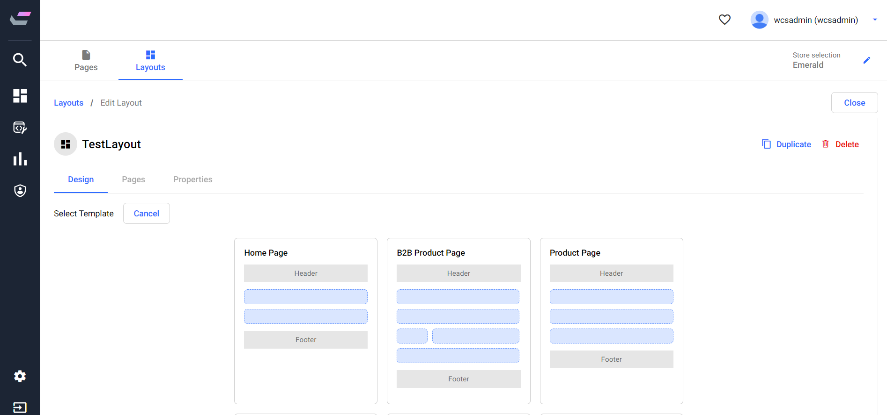
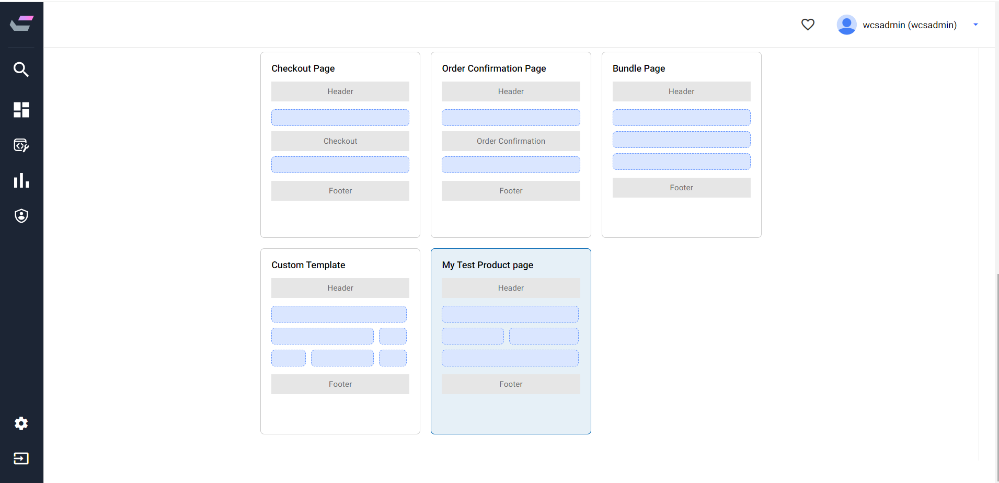

# Page Composer Tooling UI changes

1. Copy the layout-templates.json file into src\app\features\page-builder\components\layout-design folder in Angular Tooling UI project
   
2. Make sure you do not have conflicting ids (-8010, -8011) exists already in your layout-templates and in the widget definition table (PLWIDGETDEF)
   
3. Run the my-test-product-page.sql commands (make sure your new template page's id doesn't conflict with existing IDs in both PLWIDGETDEF & PLSTOREWIDGET tables)
4. Restart Angular tooling UI project.
5. You should be able to use this template in page composer now.
   
   
   

